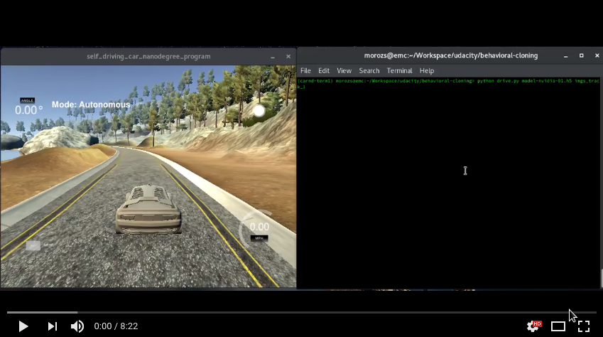

# Behavioral Cloning (Self-Driving Car Engineer Nanodegree)

This repository contains the code in a form of a pure python scripts and Jupyter notebooks 
that could be used in driver's behavioral cloning task. 
The [data set](https://yadi.sk/d/PaOHVil33HnCKz) is available and 
consists 235260 images labeled with the corresponding steering angles.
The model of convolutional neural network that can drive a car autonomously can be obtained via [model.h5](./model.h5).
There is also [`Writeup.md`](./Writeup.md) that summarizes the work done.

Below is the video that demonstrates the performance of the trained model using 
[Udacity's driving simulator](https://github.com/udacity/self-driving-car-sim).

